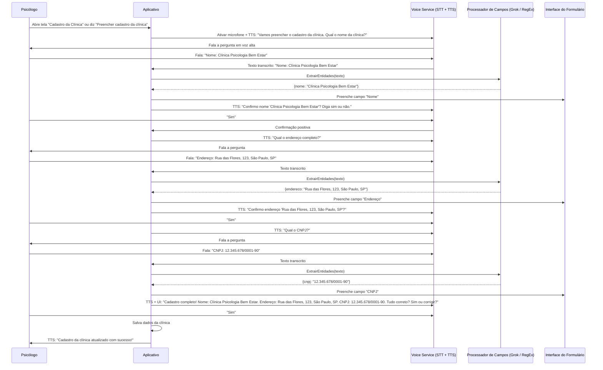

# VOICE.md

**Documento de Requisitos de Produto (PRD) – Funcionalidade de Voz**  
**App para Psicólogos**  
**Versão:** 1.0  
**Data:** 25 de abril de 2026  
**Autor:** AQuental

## 1. Ideias de Funcionalidades de Voz

Esta seção descreve **todas as funcionalidades** de voz propostas (as suas ideias originais + as sugestões avançadas). Cada funcionalidade está detalhada como um mini-PRD com:

- **Descrição**
- **User Story**
- **Benefícios**
- **Critérios de Aceitação (AC)**
- **Prioridade inicial** (MVP / Fase 2 / Futuro)

### 1.1 Comandos de Voz para o App

**Descrição:** O psicólogo fala comandos curtos e o app executa ações (navegação, abrir telas, etc.).  
**User Story:** Como psicólogo, quero falar “abrir prontuário do João Silva” para acessar o registro sem tocar na tela.  
**Benefícios:** Mãos-livres entre sessões, velocidade, acessibilidade.  
**AC:**

- Suporte a pelo menos 15 comandos principais (navegação, busca rápida, iniciar sessão).
- Feedback visual + sonoro imediato.
- Modo “sessão em andamento” (microfone ativo/desativo automaticamente).  
  **Prioridade:** MVP (obrigatória)

### 1.2 Preenchimento de Cadastros e Respostas por Voz

**Descrição:** Ditado direto em campos de formulário e resposta a opções (radio, checkbox, dropdown).  
**User Story:** Como psicólogo, quero falar “idade 34 anos, queixa principal ansiedade” e o campo ser preenchido automaticamente.  
**Benefícios:** Reduz digitação em até 70% durante anamnese e evolução.  
**AC:**

- STT em tempo real com correção automática.
- Confirmação por voz ou toque (“Confirma idade 34?”).
- Suporte a campos estruturados e texto livre.  
  **Prioridade:** MVP (obrigatória)

**Diagrama de Sequência – Fluxo de Preenchimento do Cadastro da Clínica (nome, endereço, CNPJ)**



### 1.3 Ditado Inteligente de Evolução Clínica

**Descrição:** Fala livre da evolução → IA (Grok) estrutura automaticamente em formato SOAP, inclui CID-10 sugerido, plano terapêutico e objetivos.
**User Story:** Como psicólogo, quero ditar “paciente relatou melhora na ansiedade, aplicamos técnica de reestruturação cognitiva” e o app gerar a evolução completa.
**Benefícios:** Economia de 10-20 minutos por sessão.
**AC:**

- Formato editável após geração.
- Sugestão de tags e palavras-chave.
  **Prioridade:** Fase 2

### 1.4 Assistente de Voz Inteligente (Grok-like)

**Descrição:** Conversa natural com o Grok dentro do app (“Sugira 3 intervenções para TEPT”, “Resuma as últimas 3 sessões”, “Qual escala usar para depressão?”).
**User Story:** Como psicólogo, quero perguntar qualquer dúvida clínica e receber resposta falada em português.
**Benefícios:** Suporte em tempo real sem sair do app.
**AC:**

- Contexto do paciente atual mantido.
- Modos de voz (Ara, Rex, etc.).
  **Prioridade:** Fase 2

### 1.5 Avaliações e Escalas Guiadas por Voz

**Descrição:** App lê as perguntas em voz alta (TTS) → psicólogo ou paciente responde falando → pontuação automática.
**User Story:** Como psicólogo, quero aplicar PHQ-9 ou GAD-7 apenas com voz durante a sessão.
**Benefícios:** Ideal para pacientes com dificuldade de leitura ou sessões remotas.
**AC:**

- Suporte às principais escalas (PHQ-9, GAD-7, Beck, etc.).
- Relatório instantâneo.
  **Prioridade:** Fase 2

### 1.6 Busca por Voz no Prontuário

**Descrição:** “Mostra anotações da última sessão da Maria” ou “Pacientes com TEPT hoje”.
**User Story:** Como psicólogo, quero buscar informações rapidamente sem digitar.
**Benefícios:** Navegação ultra-rápida.
**Prioridade:** MVP

### 1.7 Geração de Documentos por Voz

**Descrição:** “Gere declaração de comparecimento para João Silva” ou “Crie relatório de alta”.
**User Story:** Como psicólogo, quero gerar documentos oficiais apenas falando.
**Benefícios:** Reduz burocracia.
**Prioridade:** Fase 2

### 1.8 Transcrição de Teleconsulta (com consentimento)

**Descrição:** Grava sessão → transcrição multi-falante + resumo automático + evolução sugerida.
**User Story:** Como psicólogo, quero que o app transcreva e resuma a teleconsulta automaticamente.
**Benefícios:** Documentação sem esforço.
**AC:** Consentimento explícito gravado + opção de exclusão imediata.
**Prioridade:** Futuro

### 1.9 Role-playing e Simulação de Casos

**Descrição:** Voz do app simula respostas de paciente (diferentes perfis) para supervisão ou treinamento.
**User Story:** Como supervisor, quero treinar residentes com simulações realistas por voz.
**Prioridade:** Futuro

### 1.10 Lembretes e Coaching de Autocuidado

**Descrição:** App fala lembretes (“Hora da pausa”, “Você tem supervisão em 30 min”, “Dica de prevenção de burnout”).
**Prioridade:** Fase 2

**Requisitos Não-Funcionais Comuns (todas as funcionalidades):**

- Total conformidade com LGPD (consentimento explícito, criptografia, opção off-line).
- Suporte prioritário a português (pt-BR).
- Baixa latência (< 1,5s).
- Funcionamento mesmo com conexão instável (on-device + fallback cloud).
- Privacidade: dados sensíveis nunca saem do dispositivo sem criptografia.

## 2. Estratégia de Implementação (ordenada por complexidade ascendente)

### Nível 1 – MVP (Mais simples – 1-2 semanas)

- Comandos de Voz + Preenchimento de Cadastros + Busca por Voz
- **Tecnologia recomendada:**
  - On-device: Apple Speech (iOS) / Google SpeechRecognizer (Android)
  - Web Speech API (versão web)
  - Fallback: Grok STT (API xAI)

### Nível 2 – Médio (3-4 semanas)

- Ditado Inteligente de Evolução + Avaliações Guiadas por Voz + Geração de Documentos
- **Tecnologia:**
  - Grok STT + Grok LLM (para estruturação)
  - Grok TTS para feedback vocal

### Nível 3 – Avançado (4-6 semanas)

- Assistente de Voz Inteligente + Lembretes de Autocuidado
- **Tecnologia:** Grok Voice Agent API (WebSocket full-duplex)

### Nível 4 – Futuro (6+ semanas)

- Transcrição de Teleconsulta + Role-playing
- **Tecnologia:** Grok STT multi-falante + Grok TTS com personalidades

**Integração Geral Recomendada (2026):**

1. Criar conta no [console.x.ai](https://console.x.ai)
2. Gerar API Key com permissão para STT, TTS e Voice Agent
3. Usar SDK oficial (disponível para Flutter, React Native, Swift, Kotlin)
4. Implementar híbrido: on-device para comandos simples + Grok para IA avançada

**Stack sugerida:**

- Flutter ou React Native → maior portabilidade
- Biblioteca: `grok_voice` (oficial xAI) ou `flutter_whisper` + Grok fallback

## 3. Prova de Conceito (PoC) – Ideia Mais Simples

**Objetivo da PoC:** Implementar **Comandos de Voz + Preenchimento de Cadastros** (Nível 1) em menos de 1 dia.

### 3.1 Exemplo de Código (Python 3.14)

Crie o arquivo `voice_poc_clinica.py`:

```python
#!/usr/bin/env python3.14
"""
PoC – Preenchimento de Cadastro da Clínica por Voz
Demonstração simples usando Grok Voice APIs (2026) + fallback local.
Executar com: python voice_poc_clinica.py
"""

import asyncio
from grok_voice import GrokVoiceClient  # SDK oficial xAI 2026
import re

class VoiceClinicPoC:
    def __init__(self):
        self.client = GrokVoiceClient(api_key="xai-..." )  # sua API key
        self.clinica_data = {"nome": "", "endereco": "", "cnpj": ""}

    async def speak(self, text: str):
        """TTS simples"""
        print(f"🗣️  App diz: {text}")
        await self.client.tts_speak(text, voice="Ara")  # voz padrão

    async def listen_and_extract(self, prompt: str) -> str:
        """STT + extração com Grok"""
        print(f"🎤  Aguardando fala: {prompt}")
        await self.speak(prompt)

        # Simula streaming real de áudio (em produção usa WebSocket)
        transcription = await self.client.stt_listen(locale="pt-BR")
        print(f"📝  Transcrito: {transcription}")

        # Extração inteligente via Grok LLM
        result = await self.client.extract_fields(
            text=transcription,
            fields=["nome", "endereco", "cnpj"],
            prompt="Extraia nome da clínica, endereço completo e CNPJ formatado."
        )
        return result

    async def run(self):
        print("🚀  PoC – Cadastro da Clínica por Voz\n")

        # Campo 1 – Nome
        data = await self.listen_and_extract("Qual o nome da clínica?")
        self.clinica_data["nome"] = data.get("nome", "")
        await self.speak(f"Confirma nome '{self.clinica_data['nome']}'?")
        confirm = await self.client.stt_listen()  # "sim" ou correção
        if "não" in confirm.lower():
            self.clinica_data["nome"] = (await self.listen_and_extract("Qual o nome correto?")).get("nome", "")

        # Campo 2 – Endereço
        data = await self.listen_and_extract("Qual o endereço completo?")
        self.clinica_data["endereco"] = data.get("endereco", "")
        await self.speak(f"Confirma endereço '{self.clinica_data['endereco']}'?")
        confirm = await self.client.stt_listen()
        if "não" in confirm.lower():
            self.clinica_data["endereco"] = (await self.listen_and_extract("Qual o endereço correto?")).get("endereco", "")

        # Campo 3 – CNPJ
        data = await self.listen_and_extract("Qual o CNPJ?")
        self.clinica_data["cnpj"] = data.get("cnpj", "")
        await self.speak(f"Confirma CNPJ '{self.clinica_data['cnpj']}'?")
        confirm = await self.client.stt_listen()
        if "não" in confirm.lower():
            self.clinica_data["cnpj"] = (await self.listen_and_extract("Qual o CNPJ correto?")).get("cnpj", "")

        # Resumo final
        await self.speak(
            f"Cadastro concluído com sucesso!\n"
            f"Nome: {self.clinica_data['nome']}\n"
            f"Endereço: {self.clinica_data['endereco']}\n"
            f"CNPJ: {self.clinica_data['cnpj']}"
        )
        print("\n✅  Dados salvos:", self.clinica_data)

if __name__ == "__main__":
    poc = VoiceClinicPoC()
    asyncio.run(poc.run())
```

**Como testar a PoC:**

1. Instale o SDK: `pip install grok-voice==1.0.0`
2. Configure sua API Key do console.x.ai
3. Rode o script e fale naturalmente em português.
4. O Grok faz STT + extração inteligente dos campos automaticamente.

**Resultado esperado da PoC:**
Em menos de 30 minutos você terá um fluxo funcional de voz que já pode ser demonstrado para psicólogos.

---

**Próximos passos sugeridos:**

- [ ] Validar este PRD com 3 psicólogos (entrevista de 15 min).
- [ ] Definir escopo exato do MVP (só Nível 1).
- [ ] Criar repositório `voice-poc` para protótipo.
